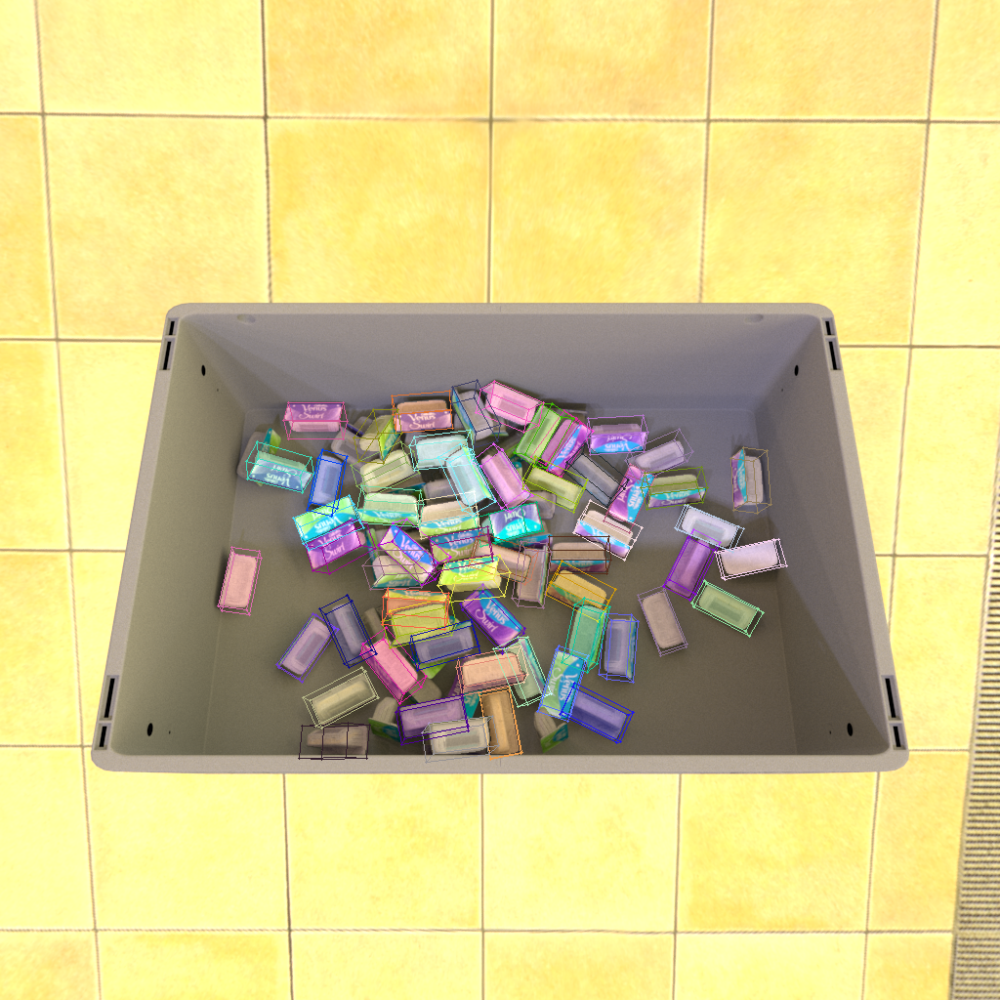

# DEPRECATED

# containers-v1-3d-bbox-to-pixels
Containers v1 - Get the 3D bboxes of items in renders and project them to pixel space



There are 3 unique SKUs. Each render contains objects of the same SKU, with different 
color schemes. The bounding box of each SKU at zero rotation/translation is hard-coded.
Based on the pose of each object in the info file, we calculate the axis-aligned 
3d bounding box of each object, then project them to pixels.

There is information about the renders in the info.json and metadata.jsonl files.
However, some information is missing. This data is hard-coded within the script:
1. The bounding box of each SKU at zero rotation/translation
2. Camera information (sensor size, field of view) 

10 Sample images are included in the repo.


## Usage

The script uses hydra for config files. Pass the root data directory containing the data to be
processed as shown below. All the files (rgb, info json, metadata) must be present directly  
in the root data directory
```shell script
python containers_3d_bbox_to_pixels.py dir_data=sample_data/
```


There is a threshold to filter out objects that are not visible in the image, based
on the number of pixels in an objects mask. Lowering this number will increase the
sensitivity and show more objects that are only partially visible:

```shell script
python containers_3d_bbox_to_pixels.py threshold_visible_object=1000
```


To enable debug information, pass the argument `hydra.verbose=true`. 
Debug will print a lot of information -> details of the transforms of 
every "visible" object in every image.

```shell script
python containers_3d_bbox_to_pixels.py hydra.verbose=true
```

## Install
Requires Python 3.

```shell script
pip install -r requirements.txt
```
